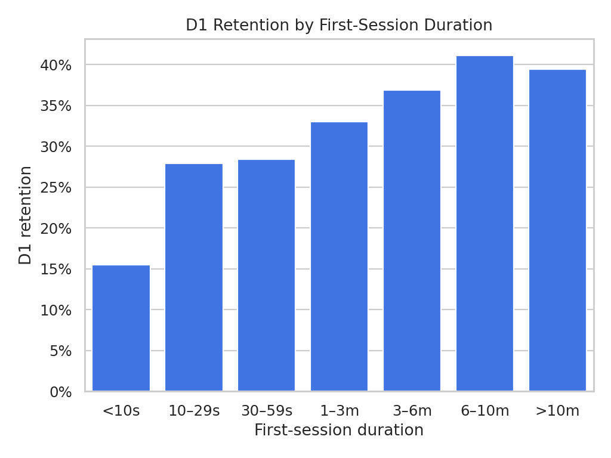

# Mobile-App Retention & Funnel Analysis

## Project overview

This project analyses a fictional mobile application's acquisition, activation, early engagement, and cohort retention. It demonstrates an end-to-end senior analytics workflow: metric definition, data validation, SQL analysis, Python visualisation, interpretation, and business recommendations.

The dataset is entirely synthetic and does not contain employer, customer, or production data.

## Business questions

1. What percentage of acquired users register and become activated?
2. How do D1, D3, D7, and D30 retention differ by acquisition channel?
3. Does first-session duration predict stronger retention?
4. Which channels attract valuable users rather than simply producing installs?
5. Where should Product and Growth teams focus to improve retention?

## Metrics

| Metric | Definition |
|---|---|
| Acquisition | First app open by a new user |
| Registration rate | Registered users ÷ acquired users |
| Activation rate | Users completing the activation event ÷ acquired users |
| D1 retention | Users active one day after acquisition ÷ eligible acquired users |
| D7 retention | Users active seven days after acquisition ÷ eligible acquired users |
| D30 retention | Users active 30 days after acquisition ÷ eligible acquired users |
| Qualified first session | First session lasting at least 30 seconds |

## Repository structure

```text
data/sample_users.csv             Synthetic example data
scripts/generate_data.py          Reproducible dataset generator
scripts/analyse_retention.py      Python analysis and charts
sql/retention_analysis.sql        BigQuery-compatible cohort SQL
outputs/                          Generated tables and visualisations
```

## How to run

```bash
pip install -r requirements.txt
python scripts/generate_data.py
python scripts/analyse_retention.py
```

## Analytical approach

- Validate user identifiers, acquisition dates, event dates, and duplicate records.
- Build acquisition cohorts by date and channel.
- Calculate registration, activation, and qualified-session rates.
- Calculate retention only when a cohort has completed the required observation window.
- Compare retention across first-session duration bands.
- Rank channels using downstream retention, not acquisition volume alone.

## Results from the synthetic dataset

The reproducible generator creates 10,000 fictional mobile-app users. Running the analysis produced the following results:

| Channel | Acquired users | Registration | Activation | D1 retention | D7 retention | D30 retention |
|---|---:|---:|---:|---:|---:|---:|
| Referral | 1,485 | 68.2% | 47.1% | 39.4% | 24.4% | 12.7% |
| Organic | 3,513 | 65.3% | 45.5% | 36.2% | 20.8% | 11.9% |
| Search | 2,033 | 59.1% | 41.8% | 31.5% | 19.0% | 9.5% |
| Paid Social | 2,969 | 55.0% | 39.5% | 25.1% | 15.4% | 8.3% |



## Key findings

1. **Referral generated the highest-quality users.** It led registration, activation, and every measured retention window, despite contributing the lowest acquisition volume.
2. **Paid Social produced scale but weaker downstream quality.** It represented almost 30% of acquired users but had the lowest D1, D7, and D30 retention.
3. **Organic acquisition delivered a strong balance of scale and quality.** It generated the largest cohort while maintaining the second-highest retention results.
4. **First-session engagement was positively associated with D1 retention.** This supports prioritising onboarding experiences that move new users toward meaningful early actions.
5. **Install volume alone would produce an incomplete campaign decision.** Channel evaluation should include activation, retention, and cost per retained user.

## Business interpretation

The analysis indicates that acquisition and product onboarding should be evaluated together. Growth teams can improve efficiency by shifting budget toward higher-quality sources, while Product teams can test onboarding changes for users with short first sessions. The results are directional because the data is synthetic; in a production setting, recommendations would be validated with campaign cost, user-value, and experiment data.

## Recommended business actions

1. Optimise campaigns using cost per retained user alongside CPI.
2. Test onboarding changes that help new users reach meaningful content faster.
3. Monitor event-tracking completeness before interpreting funnel drops.
4. Segment experiments by channel and first-session engagement.
5. Maintain a governed KPI dictionary so Product and Marketing use consistent definitions.

## Skills demonstrated

`SQL` · `Python` · `Pandas` · `BigQuery` · `Cohort Analysis` · `Retention` · `Funnels` · `Data Validation` · `Product Analytics` · `Growth Analytics` · `Business Communication`
